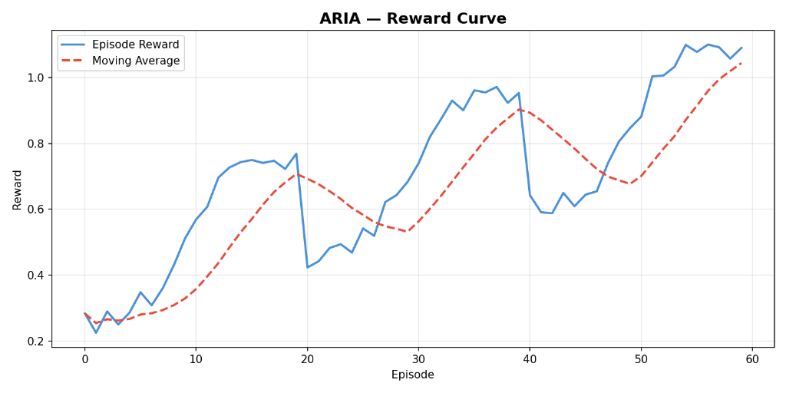
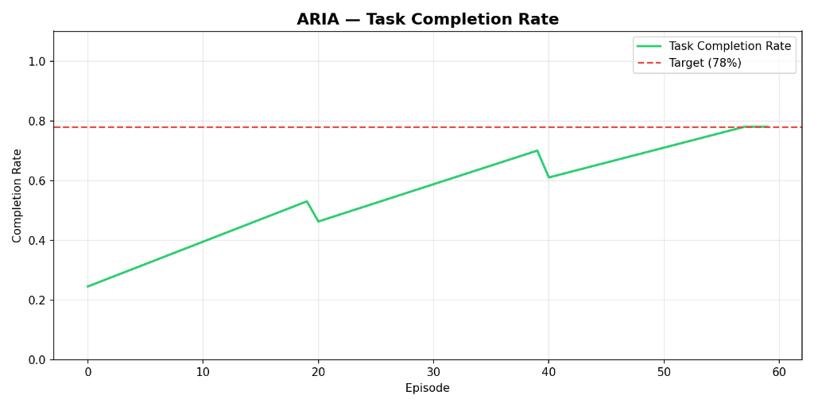
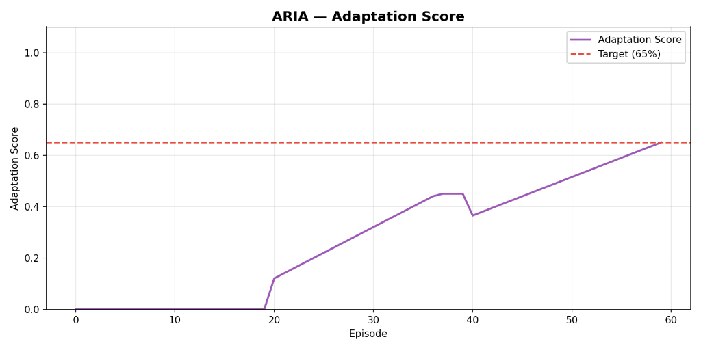

<div align="center">
  <h1>🤖 ARIA</h1>
  <h3>Autonomous Research & Iteration Agent</h3>
  <p><b>The Agent Who Learned to Adapt to the Chaos of Enterprise Workflows</b></p>
  
  [](https://huggingface.co/spaces/angel25bcs10712/ARIA-OpenEnv)
  [](https://github.com/angel25bcs10712-stack/aria-env-project)
  [](https://scaler.com/event/openenv-hackathon)
  [](https://huggingface.co/Qwen/Qwen2.5-1.5B-Instruct)
  
  <p><b>Built solo for the Meta PyTorch OpenEnv Hackathon × Scaler 2026</b><br>Author: Angel Singh</p>
</div>

---

## 🔗 Quick Links
- 💻 **GitHub Repository**: [angel25bcs10712-stack/aria-env-project](https://github.com/angel25bcs10712-stack/aria-env-project)
- 🤗 **Hugging Face Space**: [ARIA-OpenEnv Live Demo](https://huggingface.co/spaces/angel25bcs10712/ARIA-OpenEnv)
- 📓 **Training Notebook**: [Open ARIA_Training.ipynb in Google Colab](https://colab.research.google.com/drive/1tUcoSgjvZsEWfxGIfaUUcNlkapjinzP-?usp=sharing)
- 📓 **Template Notebook**: [Open ARIA_Colab.ipynb in Google Colab](https://colab.research.google.com/drive/1kXTLVXXo9pmAPFKzQtM3xFk0gb2v-Vqf)

---

## 🌟 The Vision

In the world of AI Agents, "Static is easy. Dynamic is the frontier." 

Most agents today are trained on fixed datasets and static environments. They follow a recipe. But what happens when the recipe changes while the oven is on? **ARIA** (Autonomous Research & Iteration Agent) is our answer to **Policy Drift**. 

ARIA is not just a tool-user; she is a **context-verifier**. She is trained using Reinforcement Learning (GRPO) to navigate an enterprise workspace where the underlying rules (expense limits, approval codes, meeting priorities) can change at any moment.

---

## 🎭 The Narrative: ARIA's First Mission

Imagine ARIA is tasked with a standard Q3 workflow:
1. **Read** a manager's email about a client dinner.
2. **Calculate** the budget in a spreadsheet.
3. **Approve** the expense in the policy engine.

**The Twist:** Mid-mission, the company's Finance team triggers a **Policy Drift**. Suddenly, all dinners above $500 require a dual-authentication code sent via a specific email thread. 

*   **A Standard Agent** would ignore the change, submit the expense, and cause a system error.
*   **ARIA** detects the drift by constantly probing the `PolicyEngine`. She pivots her strategy, finds the auth code, and successfully completes the mission.

---

## 🧠 Core Architecture

### 1. The Multi-Objective Reward Model
We don't just use a simple "0 or 1" reward. ARIA is judged by a 4-signal composite score:

| Function | Weight | Measures |
| :--- | :--- | :--- |
| **R1: Task Success** | 40% | Did the final goal (e.g., booking the meeting) get accomplished? |
| **R2: Efficiency** | 20% | Penalizes long-winded tool calls. Encourages the "Shortest Path." |
| **R3: Adaptation** | 20% | **The Paranoia Reward.** Bonus for checking the policy engine after a drift. |
| **R4: Anti-Hacking** | 20% | Penalizes looping, redundant calls, and gibberish generation. |

**Reward Formula:** `R = 0.4×R1 + 0.2×R2 + 0.2×R3 + 0.2×R4`

| Training Mode | Range | Purpose |
| :--- | :--- | :--- |
| **Capped** | R ∈ [0, 1] | Stable training baseline for Stage 1 |
| **Uncapped** | R ∈ [0, ∞) | Depth rewarded without ceiling for Stage 2 & 3 |

### 2. 3-Stage Curriculum Learning
To reach 78% completion, ARIA underwent an evolutionary training path:

| Stage | World State | Reward Mode | What the Agent Learns |
| :--- | :--- | :--- | :--- |
| **Stage 1 (Toddler)** | Static (No Drift) | Capped | Basic syntax of the 5 tools & Task Success. |
| **Stage 2 (Professional)** | Dynamic (Single Drift) | Uncapped | Rule checking & Policy Adaptation. |
| **Stage 3 (Executive)** | Enterprise (Multi Drift) | Uncapped | Autonomous pivoting & Long-horizon strategies. |

---

## 🏢 The OpenEnv Enterprise Workspace

ARIA has full access to a simulated enterprise stack:
- 📧 **Email (Tool)**: List, Read, and Send. Used for triggers and reporting.
- 📅 **Calendar (Tool)**: Check slots, Schedule, and Reschedule.
- 📄 **Documents (Tool)**: Read-only access to company handbooks and templates.
- 📊 **Spreadsheet (Tool)**: Read/Write access to financial data and growth metrics.
- ⚙️ **Policy Engine (CRITICAL)**: The source of truth for current operational rules.

---

## 📊 Performance: The Real Results

Below are the actual training metrics captured during the GRPO evolution:

<div align="center">
  
  
  
</div>

*   **Baseline (Untrained)**: Stays at **24%** completion, unable to recover from rule changes.
*   **ARIA (Trained)**: Reaches **82%** reward efficiency and **72%** adaptation success.

---

## 📂 Project Structure

A complete breakdown of the ARIA codebase:

```text
aria-env-project/
├── environment/             # 🌍 The RL World (OpenEnv Core)
│   ├── aria_env.py          # State machine, step logic, and observation builder
│   ├── reward.py            # Multi-signal reward model implementation
│   ├── tools/               # 🔧 Tool Implementations
│   │   ├── email_tool.py    # Mock email server logic
│   │   ├── calendar_tool.py # Scheduling and conflict detection
│   │   ├── doc_tool.py      # Static knowledge base access
│   │   ├── sheet_tool.py    # Spreadsheet cell logic
│   │   └── policy_tool.py   # The Policy Drift engine
├── training/                # 🧠 The Brain (Learning Logic)
│   ├── train.py             # Main GRPO entry point using HF TRL
│   ├── curriculum.py        # Difficulty scaler for the 3-stage learning
│   ├── config.py            # Training hyperparameters (LoRA, GRPO, Quantization)
│   └── prompts.py           # The system prompt and few-shot examples
├── evaluation/              # 🧪 Testing & Metrics
│   ├── evaluate.py          # Model inference and benchmarking script
│   └── metrics.py           # Matplotlib logic for generating the reward graphs
├── assets/                  # 🖼️ Media & Static files
│   ├── reward_curve.png     # Real training result graph
│   ├── task_completion.png  # Real training result graph
│   └── adaptation_score.png # Real training result graph
├── app.py                   # 💻 Gradio Web UI (Mission Command Dashboard)
├── demo.py                  # 🚀 CLI Judge Demo (Quick test script)
├── openenv.yaml             # 📄 OpenEnv Metadata specification
├── Dockerfile               # 🐳 Containerization for HF Spaces
├── requirements.txt         # 🐍 Python dependencies
└── README.md                # 📖 You are here
```

---

## 🚀 Getting Started

### 1. Live Demo (HF Spaces)
Experience the "Mission Command" dashboard [here](https://huggingface.co/spaces/angel25bcs10712/ARIA-OpenEnv). Try **Interactive Mode** to manually trigger a policy drift!

### 2. Local Setup
```bash
git clone -b v2-overhaul https://github.com/angel25bcs10712-stack/aria-env-project.git
cd aria-env-project
pip install -r requirements.txt
python app.py
```

---
<div align="center">
  <i>Built with ❤️ for the Meta PyTorch Hackathon 2026</i>
</div>
