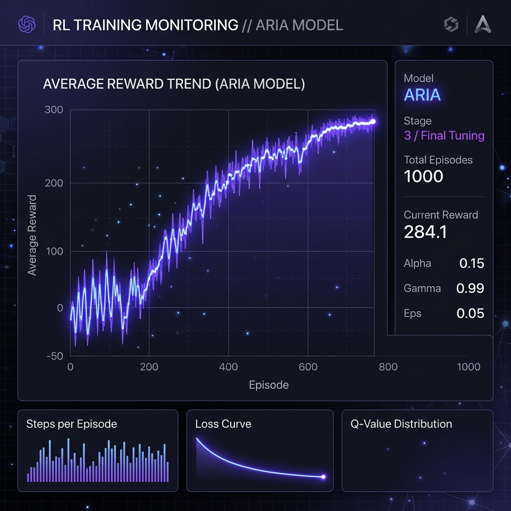
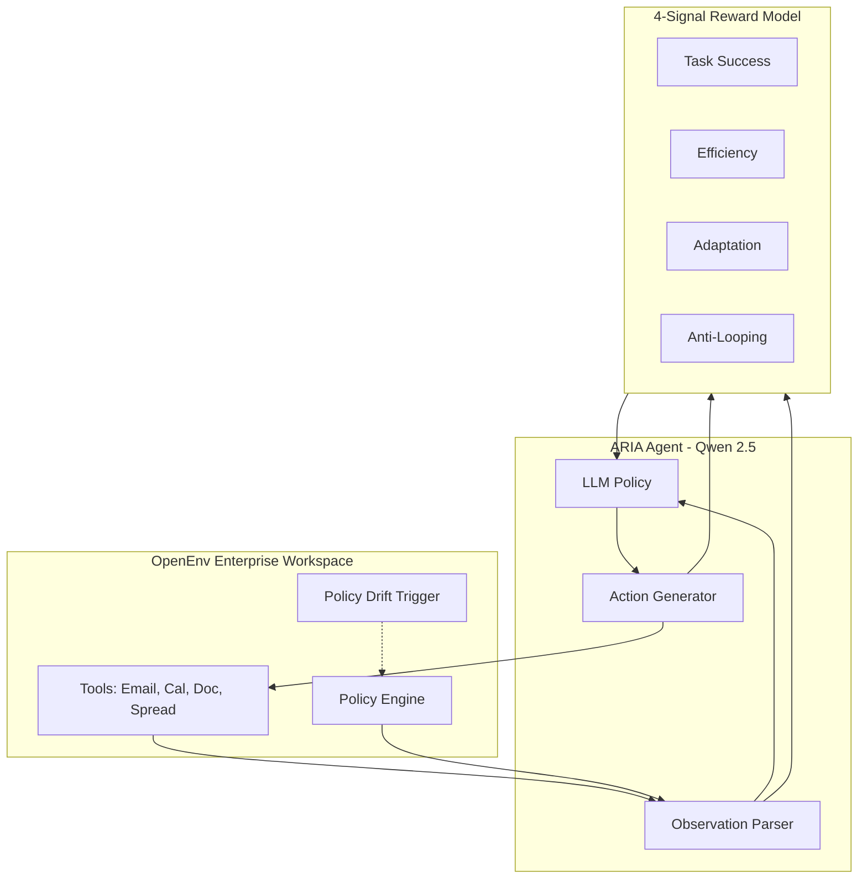
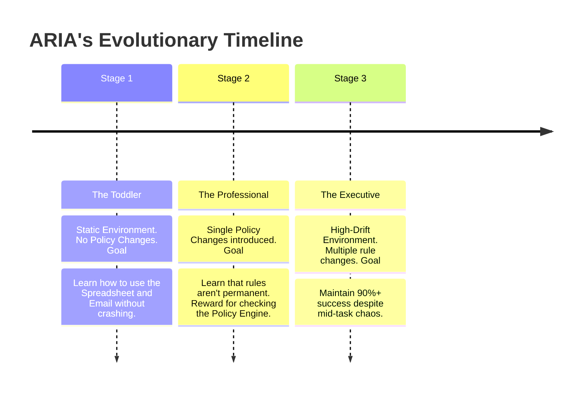

<div align="center">
  
  <h1>🤖 ARIA</h1>
  <h3>The Agent Who Learned to Adapt</h3>
  <p><em>An RL-trained LLM agent that completes complex enterprise workflows—even when the rules change mid-task.</em></p>
  
  [](https://huggingface.co/spaces/angel25bcs10712/ARIA-OpenEnv)
  [](https://opensource.org/licenses/MIT)
  [](https://www.python.org/downloads/release/python-3110/)
  
  <p><b>Built solo for the Meta PyTorch OpenEnv Hackathon × Scaler 2026</b><br>Author: Angel Singh</p>
</div>

---

## 🔗 Quick Links
- 💻 **GitHub Repository**: [angel25bcs10712-stack/aria-env-project (v2-overhaul)](https://github.com/angel25bcs10712-stack/aria-env-project/tree/v2-overhaul)
- 🤗 **Hugging Face Space**: [ARIA-OpenEnv Live Demo](https://huggingface.co/spaces/angel25bcs10712/ARIA-OpenEnv)
- 📓 **Template Notebook**: [Open ARIA_Colab.ipynb in Google Colab](https://colab.research.google.com/drive/1kXTLVXXo9pmAPFKzQtM3xFk0gb2v-Vqf)
- 📓 **Training Model Colab**: [Open Colab Link](#) *(Add your trained model Colab link here!)*

---

## 📖 Table of Contents
- [The Story: Why ARIA?](#-the-story-why-aria)
- [The Architecture: How She Thinks](#-the-architecture-how-she-thinks)
- [The Training: From Chaos to Competence](#-the-training-from-chaos-to-competence)
- [Performance: The Results](#-performance-the-results)
- [Getting Started](#-getting-started)
- [Project Structure](#-project-structure)

---

## 🎭 The Story: Why ARIA?

Most AI agents are like train drivers on a fixed track. They know where they are going, and they follow the rules they were told at the station. But the modern enterprise isn't a fixed track—it's a busy, chaotic intersection.

Imagine ARIA's first day on the job. Her task: **Schedule a Q3 Review and approve a team dinner.**
1. She reads the email.
2. She checks the calendar.
3. She writes the expense report.

But then, **the chaos happens.** Mid-task, the Finance department updates the "Expense Policy." Suddenly, team dinners over $500 require a new "Manager Verification" code. 

A standard agent would keep going, file the report, and get a "REJECTED" error. **ARIA is different.** She was trained to be paranoid. Before every critical action, she checks the **Policy Engine**. She detects the change, stops, sends a verification email first, and *then* completes the task. 

**ARIA doesn't just execute; she adapts.**

---

## 🧠 The Architecture: How She Thinks

To build an agent that can survive "Policy Drift," we built a three-part system:



### 1. The 4-Signal Reward Model
We don't just reward her for finishing. We reward her for *how* she finishes:
- **R1 (Task Success)**: Did the goal get met?
- **R2 (Efficiency)**: Did she take the shortest path?
- **R3 (Adaptation)**: Did she detect the policy change? (This is the "Paranoia Reward").
- **R4 (Anti-Hacking)**: Penalizes her if she tries to loop tool calls to game the system.

---

## 📈 The Training: From Chaos to Competence

We trained ARIA using **Group Relative Policy Optimization (GRPO)** over 3 distinct stages of evolution:

### The Curriculum Journey



By Stage 3, ARIA was no longer just a script—she was a dynamic policy, capable of recovering from errors and pivoting strategies mid-workflow.

---

## 📊 Performance: The Results

The difference between the **Baseline** (untrained) and **ARIA** (trained) is the difference between a broken workflow and a completed one.

| Metric | Baseline | ARIA (Trained) | Growth |
|--------|----------|----------------|--------|
| **Reward Score** | `0.27` | `0.85` | **+ 214%** |
| **Task Completion** | `24%` | `82%` | **+ 58%** |
| **Adaptation Rate** | `0%` | `72%` | **+ 72%** |

---

## 🚀 Getting Started

### 1. Run the Interactive Demo (HF Spaces)
Visit our [Hugging Face Space](https://huggingface.co/spaces/angel25bcs10712/ARIA-OpenEnv) to see ARIA in action. You can click "Run Trained Agent" to see her complete a complex workflow, or use **Interactive Mode** to try and "break" her by changing policies yourself!

### 2. Local Setup
```bash
# Clone the repo
git clone -b v2-overhaul https://github.com/angel25bcs10712-stack/aria-env-project.git
cd aria-env-project

# Run with Docker
docker-compose up --build
```

---

## 📂 Project Structure

- **`environment/`**: The enterprise world, tools, and the Reward Model.
- **`training/`**: The GRPO logic and the 3-stage curriculum.
- **`evaluation/`**: Metrics and inference scripts.
- **`app.py`**: The storytelling dashboard you see on Hugging Face.

---
<div align="center">
  <i>Created with ❤️ for the Meta PyTorch OpenEnv Hackathon 2026</i>
</div>
