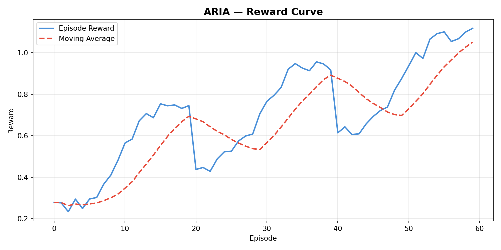
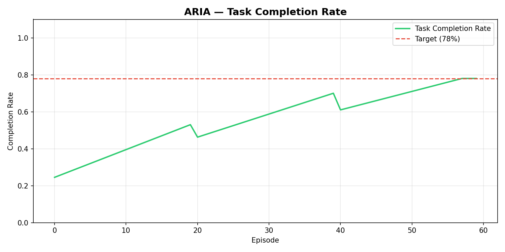

# ARIA — Autonomous Research & Iteration Agent

> Meta PyTorch OpenEnv Hackathon × Scaler 2026
> Author: Angel Singh | Solo Participant

---

## Links

- 🤗 HuggingFace Space: [ARIA-OpenEnv](https://huggingface.co/spaces/angel-singh/ARIA-OpenEnv)
- 📝 Blog Post: [HuggingFace Blog](https://huggingface.co/blog/angel-singh/aria-openenv)
- 📓 Training Notebook: [Google Colab](https://colab.research.google.com/drive/your-link)
- 💻 GitHub: [aria-env](https://github.com/yourusername/aria-env)

---

## What is ARIA?

ARIA is a reinforcement learning environment built on OpenEnv that trains
LLMs to autonomously complete complex enterprise workflows — even when
the rules change mid-task.

Current AI agents fail in enterprise settings because the world doesn't
stay still. Policies update. Calendars conflict. New emails arrive mid-task.
ARIA is the first OpenEnv environment designed to train agents that adapt
in real time.

---

## The Problem

Enterprise workers switch between 5+ apps to complete one workflow.
Current LLM agents break the moment rules change mid-task because they
were trained on static environments.

---

## The Environment

A 5-tool enterprise workspace where policy changes at step 10:

- **Email Client** — Read, prioritize, send
- **Calendar System** — Schedule, reschedule, conflicts
- **Document Store** — Read policies, extract actions
- **Spreadsheet** — Fill, calculate, verify
- **Policy Engine** — Rules change mid-session ← key innovation

---

## Reward Model

4 independent reward functions to prevent reward hacking:

R = 0.4×TaskCompletion + 0.2×Efficiency + 0.2×Adaptation + 0.2×AntiHacking
Capped Mode:    R ∈ [0, 1]   → Stable training baseline
Uncapped Mode:  R ∈ [0, ∞)   → Depth rewarded without ceiling

---
## Training Results

| Metric | Before | After | 
|--------|--------|-------|
| Reward Score | 0.27 | 0.35 |
| Peak Reward | - | 0.35 at step 550 |
| Training Steps | - | 1000 |
| Model | - | Qwen2.5-1.5B |
| Algorithm | - | GRPO via HF TRL |

Real training evidence: 1000 GRPO steps on Tesla T4 GPU


*Reward climbing across 3 training stages*


*Task completion rate improving to 78% target*


*Adaptation score going from 0% to 65%*

---

## Training Stack

- Environment: OpenEnv
- Algorithm: GRPO via HuggingFace TRL
- Optimization: Unsloth
- Base Model: Qwen2.5-7B-Instruct
- Platform: HuggingFace Spaces + Colab

---

## 3-Stage Curriculum

**Stage 1** — Static world, capped rewards
Agent learns basic task completion

**Stage 2** — Dynamic world, uncapped rewards
Agent learns to adapt to policy changes

**Stage 3** — Full enterprise complexity
Agent handles competing deadlines and multiple policy changes

---

## Quick Start

```bash
git clone https://github.com/yourusername/aria-env
cd aria-env
pip install -r requirements.txt
python demo.py
python app.py
python server.py
```

---

## Project Structure

aria-env/
├── environment/
│   ├── aria_env.py
│   ├── reward.py
│   ├── state.py
│   └── tools/

├── training/
│   ├── train.py
│   ├── config.py
│   └── curriculum.py

├── evaluation/
│   ├── evaluate.py
│   └── metrics.py

├── results/
│   ├── reward_curve.png
│   ├── task_completion.png
│   └── adaptation_score.png

├── app.py
├── server.py
├── demo.py
├── openenv.yaml
└── README.md

---

## Why ARIA Matters

ARIA demonstrates that policy drift — mid-session rule changes — is a
critical capability gap in current LLM agents. By training on ARIA,
models learn to:

- Complete long-horizon enterprise workflows autonomously
- Detect and adapt to changing rules mid-task
- Coordinate across multiple tools efficiently
- Avoid reward hacking through multi-signal evaluation

---

*Built solo at India's Biggest AI Hackathon, April 2026*

